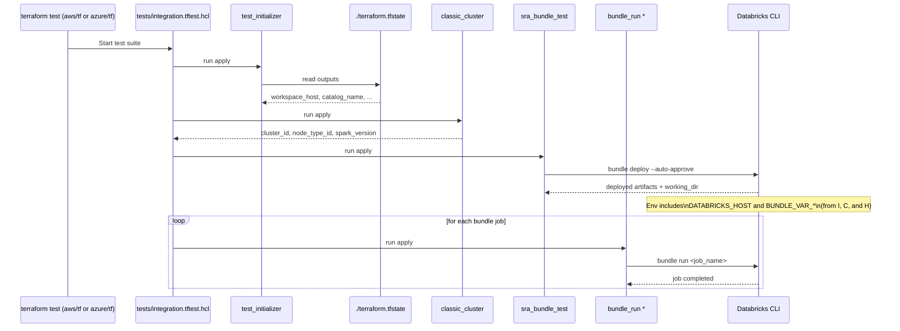

# Common Tests Overview

This directory contains reusable Terraform modules that power the end-to-end integration tests for this repository. Cloud-specific test suites (for example, `aws/tf/tests` and `azure/tf/tests`) orchestrate these modules using Terraform's native testing framework (`terraform test`).

At a high level, the cloud test suite will:
- Initialize context by reading the already-applied environment state (workspace host, catalog name, etc.).
- Provision a small, short‑lived classic cluster for running example workloads.
- Deploy Databricks Asset Bundle resources (jobs, notebooks, experiments, models) defined under `sra_bundle_test/bundle`.
- Execute those bundle jobs (Spark basic, ML workflows, Lakehouse connectivity) and optionally open their pages in a browser.

These tests validate that the deployed workspace can execute typical workflows end-to-end.

## Call stack



## Prerequisites

- Terraform 1.6+ (for `terraform test`).
- Databricks Terraform provider (downloaded automatically by Terraform).
- Databricks CLI v0.218+ (provides `databricks bundle ...`).
- Authentication to Databricks for both Terraform and the CLI:
  - Environment variables or profile for the provider and CLI (for example, `DATABRICKS_HOST`, `DATABRICKS_TOKEN`), or a supported cloud identity flow.
  - Note: If you have already configured your environment for `terraform apply`, `terraform test` should work exactly the same.
- An environment that has already been applied via the cloud root (`aws/tf` or `azure/tf`) so that the local `terraform.tfstate` in that directory contains required outputs (for example, workspace host, catalog name).

## How the tests are orchestrated

Cloud suites in `aws/tf/tests` and `azure/tf/tests` use `.tftest.hcl` files to orchestrate the flow. They pass variables and environment into the modules in this folder. Important patterns you will see in those files:

- A "test initializer" run to read outputs from the local state in the cloud directory (`./terraform.tfstate`).
- Computation of an `environment` map that is provided to the Databricks CLI Bundles commands, including:
  - `DATABRICKS_HOST`
  - `BUNDLE_VAR_node_type_id`, `BUNDLE_VAR_spark_version`, `BUNDLE_VAR_catalog_name`, `BUNDLE_VAR_sra_tag`, `BUNDLE_VAR_cluster_id`
  - These become available to the bundle via `${var.*}` references in `databricks.yml` and job YAML files.
- Sequential runs that:
  1) deploy the bundle assets, and
  2) run individual bundle jobs like `spark_basic`, `ml_workflow_classic`, `ml_workflow_serverless`, followed by cleanup jobs.

## Modules in this directory

- `test_initializer/`
  - Reads the local Terraform state from the cloud directory (path is resolved at test runtime) and exposes its outputs to the test. This provides values like workspace host and catalog name without duplicating data sources here.

- `classic_cluster/`
  - Provisions a small autoscaling classic cluster suitable for test jobs.
  - Outputs: `cluster_id`, `node_type_id`, `spark_version`.
  - Uses provider authentication from the environment (for example, `DATABRICKS_HOST`/`DATABRICKS_TOKEN`).

- `sra_bundle_test/`
  - Deploys the bundle located at `sra_bundle_test/bundle` via `databricks bundle deploy --auto-approve` and destroys it on cleanup.
  - Exposes `working_dir` so downstream steps can run bundle jobs from the same folder.

- `bundle_run/`
  - Runs a specific bundle job via `databricks bundle run <job_name>`.
  - Variables:
    - `bundle_job_name` (string): logical job name from the bundle (not the workspace job name).
    - `working_dir` (string): directory containing `databricks.yml`.
    - `environment` (map): passed to the CLI process; must include `DATABRICKS_HOST` and any `BUNDLE_VAR_*` used by the bundle.
    - `open_test_job` (bool): if true, opens the job in a browser before running.

## Running the tests

The tests are executed from the cloud-specific Terraform roots so that the relative paths and local state resolution work correctly.

Example: Azure
```bash
cd azure/tf
# Ensure your environment is applied and state has required outputs
terraform init
terraform apply

# Run the full integration test suite
terraform test
```

Example: AWS
```bash
cd aws/tf
# Ensure your environment is applied and state has required outputs
terraform init
terraform apply

# Run the full integration test suite
terraform test
```

Notes:
- `terraform test` handles module init automatically for each run block. You do not need to run `terraform init` inside `common/tests/*`.
- The `.tftest.hcl` files may set `open_test_job = false` by default; set it to `true` to open jobs in your web browser while they run.

## What gets validated

- Bundle deploys successfully and jobs can run using values injected via `BUNDLE_VAR_*`.
- A small classic cluster can be created and used by the jobs.
- Basic Spark functionality runs, ML workflow executes (including UC model registry and reading/writing to UC tables), and Lakebase connectivity is reachable.

## Troubleshooting

- Missing or invalid `DATABRICKS_TOKEN`/`DATABRICKS_HOST`:
  - The provider or the CLI will fail to authenticate. Export env vars or configure your Databricks profile.
- No required outputs in local state:
  - Ensure you have applied the cloud root (`aws/tf` or `azure/tf`) and that the state includes outputs such as workspace host and catalog name.
- Databricks command not found:
  - Install/upgrade the Databricks CLI to a version that supports bundles and ensure it’s on your `PATH`.
