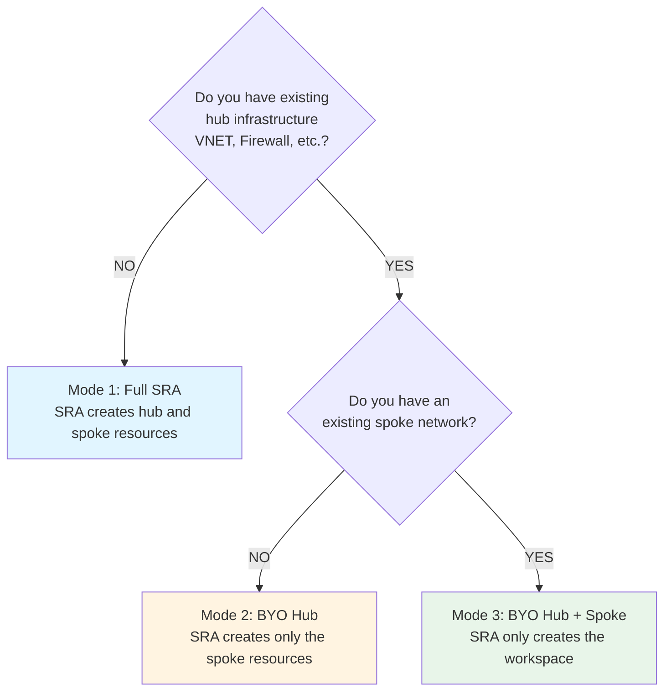

import useBaseUrl from '@docusaurus/useBaseUrl';
import Admonition from '@theme/Admonition';

# Deployment Modes Overview

Azure SRA supports three deployment modes to accommodate different organizational requirements and existing infrastructure.

## Mode Comparison

| Mode | Hub | Spoke Network | Use Case |
|------|-----|---------------|----------|
| **[Mode 1: Full SRA](./mode1-full-sra.mdx)** | SRA creates | SRA creates | Greenfield deployments |
| **[Mode 2: Bring-your-own hub](./mode2-byo-hub.mdx)** | You provide | SRA creates | Existing hub, new spoke |
| **[Mode 3: Bring-your-own hub + spoke](./mode3-byo-hub-spoke.mdx)** | You provide | You provide | Existing infrastructure (most restrictive) |

<Admonition type="info" title="Spoke Resource Group">

In both bring-your-own hub and bring-your-own hub + spoke options, you may optionally use SRA to create the spoke resource group by changing the value of the `create_workspace_resource_group` variable.

</Admonition>

## Decision Tree

Use this decision tree to determine which deployment mode is right for you:

## Quick Summary

### [Mode 1: Full SRA](./mode1-full-sra.mdx) (Default)
- **Best for:** Greenfield deployments
- **SRA creates:** Everything (hub, spoke, workspace)
- **Template:** `template.example.tfvars`

### [Mode 2: Bring-your-own Hub](./mode2-byo-hub.mdx)
- **Best for:** Teams with existing hub infrastructure
- **SRA creates:** Spoke resources only
- **You provide:** Hub VNET, Key Vault, metastore, NCC, network policy
- **Template:** `template_byo_hub.example.tfvars`

### [Mode 3: Bring-your-own Hub + Spoke](./mode3-byo-hub-spoke.mdx)
- **Best for:** Organizations with fully existing infrastructure
- **SRA creates:** Workspace and related resources only
- **You provide:** Hub VNET, Key Vault, metastore, NCC, network policy, spoke VNET
- **Template:** `template_byo_spoke_network.example.tfvars`

## Next Steps

1. Select your deployment mode using the decision tree above
2. Click on the mode link to view detailed configuration requirements
3. Copy the appropriate template file to `terraform.tfvars`
4. Fill in required variables based on your mode
5. Review [Configuration Reference](./configuration.mdx) for optional features
6. Follow [Getting Started](./gettingstarted.mdx) deployment steps
7. Review [Troubleshooting](./troubleshooting.mdx) if you encounter issues
