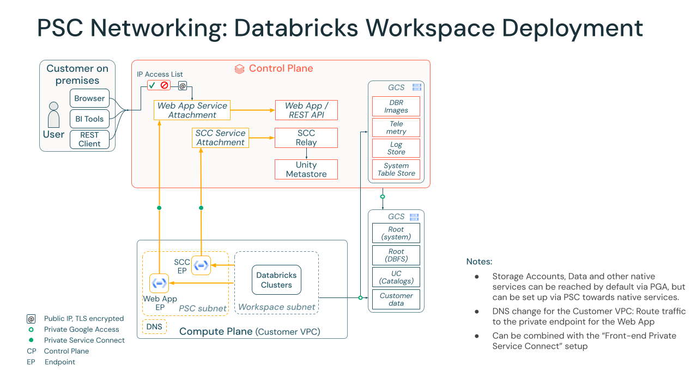

# Security Reference Architecture Template

# Introduction:

Databricks has worked with thousands of customers to securly deploy the Databricks platform with appropriate security features to meet their architecture requirements. 

This Security Reference Architecture (SRA) repository implements common security features as a unified terraform templates that are typically deployed by our security conscious customers.

Note that the private service connect blocks were previously developed in this [repository](https://github.com/bhavink/databricks/tree/master/gcpdb4u) and was helpful in putting the PSC-specific modules together.

# Component Breakdown and Description:

In this section, we break down each of the components that we've included and will be created (if not already exists) in this Security Reference Architecture.

In various .tf scripts, we have included direct links to the Databricks Terraform documentation. The [official documentation](https://registry.terraform.io/providers/databricks/databricks/latest/docs) can be found here.

## Core GCP Components:
The following resources are created and must be present before creating the workspace on Databricks:
- **Customer-managed VPC**: Using a [customer-managed VPC](https://docs.gcp.databricks.com/administration-guide/cloud-configurations/gcp/customer-managed-vpc.html) gives you direct control over network configurations, making it easier to meet strict internal security and compliance standards. This approach is required for Private Service Connect and allows you to consolidate multiple workspaces into a single network, which simplifies management and reduces the permissions Databricks needs in your account.

- **Back-end GCP Private Connectivity**: GCP Private Service Connect establishes a private network route between different GCP environments. This template configures the [back-end connection](https://docs.databricks.com/gcp/en/security/network/classic/private-service-connect), using Databricks-specific VPC endpoints to ensure that communication between your classic compute plane and the Databricks control plane does not travel over the public internet. While a [front-end](https://docs.databricks.com/gcp/en/security/network/front-end/front-end-private-connect) option is also available to keep user traffic on the GCP backbone, this particular Terraform template does not include that configuration.

- **Cloud KMS Keys**: GCP Cloud KMS keys are created to support [customer-managed keys](https://docs.databricks.com/gcp/en/security/keys/customer-managed-keys) for encryption for following functionalities:
    - Managed services: Data in the Databricks control plane (notebooks, secrets, and Databricks SQL query data).
    - Workspace storage: The two workspace storage buckets and the GCE Persistent Disk volumes of compute resources.

The following resources are created after the workspace creation:

- **Cloud DNS**: [Private DNS zone](https://docs.databricks.com/gcp/en/security/network/classic/private-service-connect#step-9-configure-dns) are required for backend Private Service Connect (PSC) on GCP to ensure that traffic destined for internal services is resolved to the private IP addresses of the PSC endpoints within the VPC.


# Getting Started:

1. Clone this Repo 

2. Install [Terraform](https://developer.hashicorp.com/terraform/downloads)

3. Fill out `example.tfvars` and place in `gcp` directory

5. Change directoy into `gcp`

5. Run `terraform init`

6. Run `terraform validate`

7. From `gcp` directory, run `terraform plan -var-file ../example.tfvars`

8. Run `terraform apply -var-file ../example.tfvars`

Note: If you are running the workspace module, please set DATABRICKS_GOOGLE_SERVICE_ACCOUNT environment variable with the Service Account email. Example :
```
export DATABRICKS_GOOGLE_SERVICE_ACCOUNT=<<Your GCP Service Account email>>
```
# Network Diagram



